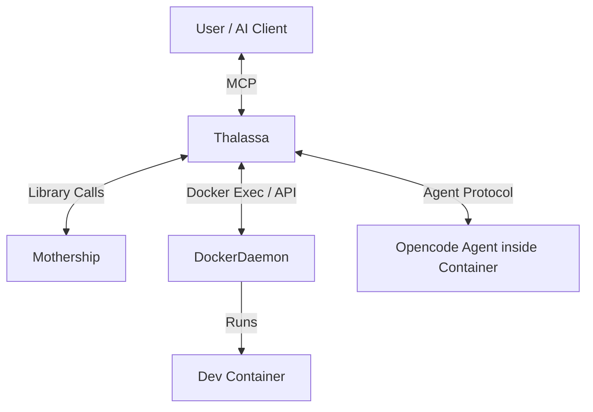

# Thalassa Architecture Plan

## 1. Overview
Thalassa is a daemon that manages Mothership development containers and runs opencode agents inside them. It exposes an MCP (Model Context Protocol) interface to allow AI agents to control the development environment and spawn nested agents.

## 2. Architecture

### 2.1 Component Structure
- **Thalassa Daemon:** A long-running Rust process that acts as the central coordinator.
- **Mothership Library:** Used by Thalassa to manage Docker containers (build, up, down).
- **Agent Protocol:** A communication mechanism between Thalassa (host) and Agents (containers).
- **MCP Server:** An interface exposed by Thalassa for external AI control.

### 2.2 Communication Flow


## 3. Analysis of Mothership & Required Changes

### Current State
- `mothership::Runtime` exposes `build`, `up`, `down`, `enter`, `launch`.
- `enter` (exec) is interactive-only (`inherit` stdio), unsuitable for programmatic control.
- No methods to list running containers, check status, or get logs programmatically.
- Configuration is loaded from disk relative to `$HOME`.

### Required Changes in Mothership
1.  **Non-Interactive Exec:** Add `exec_capture` or `exec_background` to `Runtime` that returns `Result<Output>` or a handle to a running process, allowing input/output piping.
2.  **Container Status:** Add `status(project_name)` to check if a container is running, health checks, etc.
3.  **List Projects:** Expose a way to list available projects and their states (Running/Stopped).
4.  **Log Streaming:** Add `logs(project_name)` to stream container logs.
5.  **Config Exposure:** Ensure `ProjectConfig` and `ShipConfig` structs are fully public (they seem to be, but need verification of all fields).

## 4. Thalassa Implementation Details

### 4.1 Technology Stack
- **Language:** Rust
- **Async Runtime:** Tokio
- **Web/MCP Server:** Axum (or similar) for HTTP/SSE transport of MCP.
- **IPC:** Unix Sockets or TCP for communicating with agents inside containers? 
    - *Decision:* Initially use `docker exec` for control and standard streams. For advanced events, maybe a shared volume with a socket or a TCP port forwarded. 
    - *Simpler Approach:* Thalassa injects a small "agent shim" or simply runs the opencode binary directly via `docker exec`.

### 4.2 File Structure
```
thalassa/
├── Cargo.toml
├── src/
│   ├── main.rs           # Entry point
│   ├── server/           # MCP Server implementation
│   │   ├── mod.rs
│   │   ├── tools.rs      # MCP Tool definitions
│   │   └── resources.rs  # MCP Resources
│   ├── manager.rs        # Orchestrates Mothership Runtime
│   ├── agent.rs          # Handles communication with container agents
│   └── error.rs
└── README.md
```

### 4.3 MCP Tools Interface
Thalassa will expose the following tools via MCP:

1.  **`list_ships`**: List available ship configurations (templates).
2.  **`list_projects`**: List defined projects and their status (Running/Stopped).
3.  **`create_project`**: Create a new project from a ship template.
    - Args: `name`, `ship_template`, `git_url` (optional).
4.  **`launch_project`**: Build and start a project container.
    - Args: `project_name`.
5.  **`stop_project`**: Stop a running project.
    - Args: `project_name`.
6.  **`exec_command`**: Run a one-off command inside a project container.
    - Args: `project_name`, `command`.
7.  **`spawn_agent`**: Start a long-running opencode agent session inside the container.
    - Args: `project_name`, `initial_prompt` (optional).

## 5. Messaging & Future Goals

### 5.1 Asynchronous Messages
- Thalassa needs an event loop.
- Use Tokio channels (`mpsc`) to send events from the Docker monitoring thread to the MCP server.
- MCP supports "Notifications" (server-to-client). We can use this for logs or agent status updates.

### 5.2 Telegram Integration (Future)
- Create a generic `NotificationProvider` trait.
- Implement `TelegramProvider`.
- The event loop dispatches events (e.g., "Build Failed", "Agent Task Complete") to configured providers.

## 6. Execution Plan
1.  **Refactor Mothership:** Update `Runtime` to support non-interactive exec and status queries.
2.  **Scaffold Thalassa:** Create the Rust project and dependency tree.
3.  **Implement Manager:** core logic to wrap Mothership's `Runtime`.
4.  **Implement MCP:** Basic server with `list_projects` and `launch_project`.
5.  **Agent Integration:** Implement `exec_command` logic.
